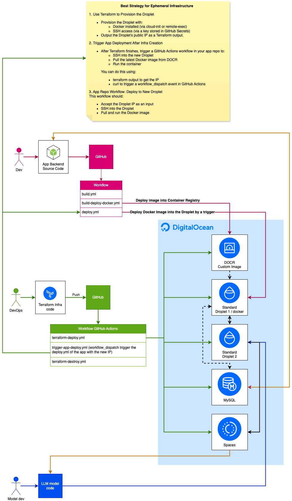

# Infra AI Super

Infrastructure repo for the AI Super App.
The infrastructure selected for this project is DigitalOcean.

## Components

- DOCR (Container Registry)
- Droplet Autoscaling Pool (Instances)
  - Backend app (set to 1)
  - LLM model app (set to 1)
- MySQL
- Spaces (Bucket Storage)
- VPC

## Infra Diagram

**Work In Progress**


## Security Notes

### Sensitive Information

This repository uses the following sensitive information that should NOT be committed to Git:

1. **DigitalOcean API Token** (`do_token`): Used for authenticating with DigitalOcean API
2. **SSH Public Key** (`ssh_key`): Used for SSH access to droplets
3. **Email Addresses** (`emails`): Used for alerts and notifications

### Setup Instructions

1. Copy `terraform.tfvars.example` to `terraform.tfvars` in each environment directory
2. Fill in your actual values in the `terraform.tfvars` file
3. Ensure `.gitignore` is properly set up to exclude `.tfvars` files

### State Management

Since DigitalOcean doesn't provide a native secrets manager, here is a secure options for state management:

- **DigitalOcean Spaces as Backend**:
   ```hcl
   terraform {
     backend "s3" {
       endpoint                    = "nyc3.digitaloceanspaces.com"
       region                      = "us-east-1"  # Required but not used
       bucket                      = "your-terraform-states"
       key                         = "dev/terraform.tfstate"
       skip_credentials_validation = true
       skip_metadata_api_check     = true
     }
   }
   ```

  - Create a Spaces bucket in your DigitalOcean account first
  - Generate Spaces access keys in the DigitalOcean control panel (API > Spaces access keys)
  - Store these Spaces access keys as environment variables: `SPACES_ACCESS_KEY_ID` and `SPACES_SECRET_ACCESS_KEY`
  - Configure your provider to use these variables:
    ```hcl
    provider "digitalocean" {
      token             = var.do_token
      spaces_access_id  = var.spaces_access_id
      spaces_secret_key = var.spaces_secret_key
    }
    ```
  - Enable versioning on your Spaces bucket for state history